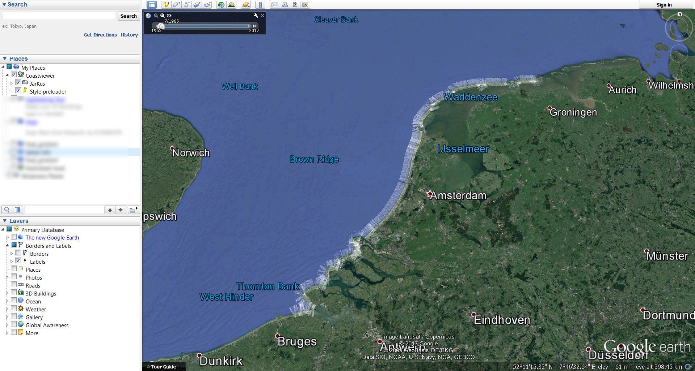
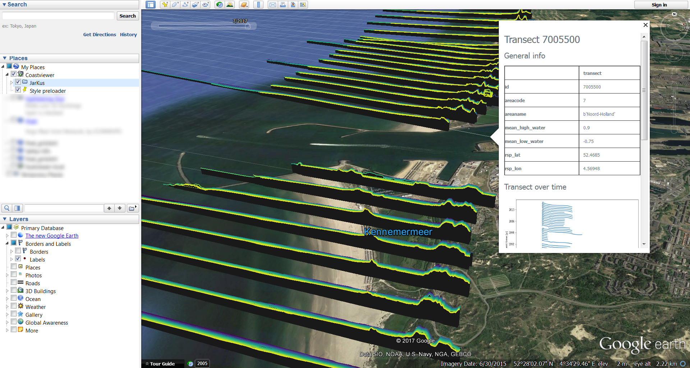
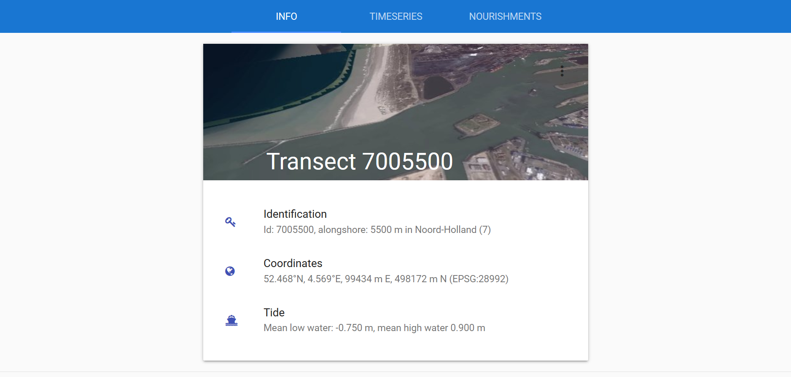

=====
Usage
=====

Introduction
------------
Obtained data from the entire Dutch coast is converted into one standardized, uniform format (NetCDF) and saved according to the `Open Earth`_ philosophy in an internet database. This data can be accessed through the OGC (Open Geospatial Consortium) KML feeds (`Google Earth`_ feeds), which can be openly accessed through the internet. This coastviewer provides these feeds. Through the KML file the data can be accessed and visualized on a map (Google Earth) more detailed information is given in graphs. This usage page describes how the data in the coastviewer can be accessed. 

.. _Open Earth: http://openearth.deltares.nl
.. _Google Earth: https://www.google.nl/intl/nl/earth/

Walkthrough
-----------
The coastviewer is a package that allows the user to run the program locally.  In the `readme`_ the steps to install the coastviewer locally are described. The locally run package provides a link to the kml at: 

http://localhost:5000/coastviewer/1.1.0/transects/kml

The coastviewer should run on your computer (using the steps of the `readme`_). Either use the link above as network link or otherwise use the network link of the online version:

http://dev-env.myfjvt76zf.eu-west-1.elasticbeanstalk.com/coastviewer/1.1.0/transects/kml

This link can be opened in Google Earth. Within Google Earth click on Add -> Network Link.  Provide a name and paste the network link. The JarKus transects are shown along the entire Dutch coast. 

These transects can be analysed in more detail. When zooming into a section of the coast the individual depth profiles become visible. In the top left of the screen a time bar is shown. This bar can be used to select a time span of data to be shown. This gives a good overview of the overall dynamics of the coast profile. More information per transect is given when clicking on a transect. A small pop-up will appear containing general information and two transect plots over time. For even more information a link is provided when scrolling down in the pop-up called 
. When clicked upon you are redirected to a webpage. 

The webpage provides three tabs with information concerning the selected transect. The first tab 'INFO' provides general information about the transect.

The second tab 'TIMESERIES' provides two timeserie plots of the transect. The uppermost plot gives the cross-shore profile of the transect in time. The second plot does the same, but visualizes it in a topographic map and combines the mean high/low waterline contours. Both figures can be exported (png, pdf or svg format). The third tab 'NOURISHMENTS' shows three plots with indicators for the coastal state. 

.. _readme: https://github.com/openearth/coastviewer/blob/master/README.md
